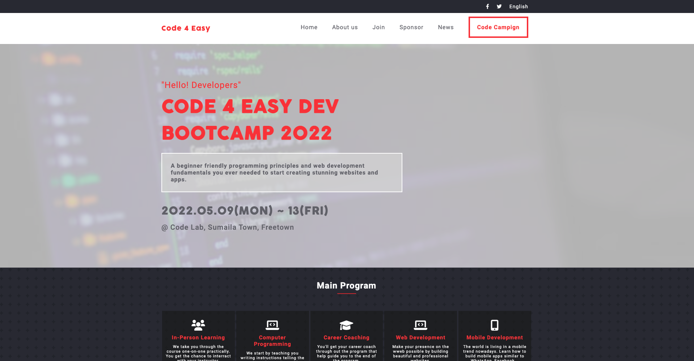

# Code 4 Easy Capstone Project

 Thi Capstone project is a project required students to build a website from scratch. It's a solo project for all students as it marks the end of a module. The idea is to follow a design given in the curriculum and each student is asked to come up with an idea and build the project on it and make the dsign look closely similar.

#### Mobile Screenshot

## Built With

- HTML and CSS

- ESLint

- JavaScript

## Live Demo

<a href="https://amkam-dev-bootcamp.netlify.app/">Code 4 Easy</a>

## Video about the project and demo work through

## Getting Started

To get a local copy up and running follow these simple example steps.

- Clone this repository to your local machine
- git clone https://github.com/ishmaelkargbo/Portfolio.git
- cd Portfolio
- Open `index.html` file in a browser of your choice

## Authors

👤 **Ishmael Kargbo**

- GitHub: [@githubhandle](https://github.com/ishmaelkargbo)
- Twitter: [@twitterhandle](https://twitter.com/ishoKargbo)
- LinkedIn: [LinkedIn](https://linkedin.com/in/ishmael-kargbo-9a986a214)

## 🤝 Contributing

Contributions, issues, and feature requests are welcome!

Feel free to check the [issues page](../../issues/).

## Show your support

Give a ⭐️ if you like this project!

## Acknowledgments

- The original design of this project is done by <a href="https://www.behance.net/gallery/29845175/CC-Global-Summit-2015">Cindy Shin in Behance.</a>. Owned by <a href="https://creativecommons.org/licenses/by-nc/4.0/">Creative Commons license of the design</a>.